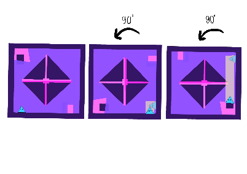

# Identificación
**Turno:** Miércoles 11:00 - 13:00

* **Raquel García Guillem**: raquelgg00
* **Diego Valero Bueno**: diegovb7
* **Laura Gil López**: Lauriscus20
* **Guillermo Novelda Mortes**: gnm5
* **Gaspar Mora Rico**: GaspiMr6
* **Vanessa Davó Parreño**: VanessaDP

# 1. Ficha del juego
## Título del juego
The First Form

## Sistema del juego
El sistema de juego es un conjunto de niveles de tipo secuencial. Entre niveles, el personaje adquirirá habilidades y objetos que le permitirán evolucionar y avanzar en el juego. El mapa se divide en 3 fases relacionadas con las etapas de desarrollo emocional del personaje. Dependiendo de la zona del mapa los niveles serán distintos, teniendo todos en común el uso de las formas y los colores para su diseño. Además la dificultad irá en aumento, siendo cada vez los niveles más complejos.

## Público objetivo
El público al que va dirigido nuestro juego es un público adolescente-joven que tiene interés en resolver puzzles y en el desarrollo y evolución de los personajes, es decir, aquel usuario que tenga sensibilidad por el mundo emocional y la abstracción.

## Resumen de la historia del juego orientada a la jugabilidad
La historia de este juego trata sobre nuestra forma. Al principio el usuario podrá controlar un pequeño triángulo que apenas será capaz de contemplar el mundo e identificar las formas básicas de la geometría. 

El objetivo es que el personaje vaya aprendiendo a través de los puzzles a desarrollar la razón y las emociones. Para ello, irá adquiriendo habilidades(emociones) que le ayudarán a enfrentarse a nuevos niveles. El jugador acompañará al personaje mientras evoluciona y explora un mundo abstracto. Las decisiones que tome el jugador harán que el personaje adquiera nuevas formas. 

Para las fases de los niveles nos hemos basado en las Etapas de Piaget:

 1. **Sensiomotriz:** En esta etapa del desarrollo se interactúa a través de los sentidos y no de una condición física, por tanto, el personaje solo podrá cambiar de color, saltar y rebotar para hallar la salida al nivel.

 2. **Etapa preoperacional:** En la segunda etapa del desarrollo ya se pueden modificar objetos a través de la imaginación y entender operaciones solo por su apariencia. Por tanto, el personaje, además de lo comentado en la primera etapa, podrá mover objetos y modificarlos.

 3. **Etapa de operaciones concretas y etapa de operaciones formales:** En la tercera etapa del desarrollo ya se pueden realizar operaciones lógicas, por tanto, aumenta la complejidad de los puzzles, teniendo que cambiar la gravedad. Aparecen nuevos componentes del juego que van a hacer que el usuario emplee las nuevas habilidades adquiridas, además de todas las que ya tenía.

## Modos de juego
El videojuego contará con un único modo de juego "Historia" o "Modo aventura" . En este modo de juego hemos mezclado distintos géneros en los niveles. El jugador encontrará niveles de puzzles mezclados con plataformas.

## Diferencias con respecto a otros juegos del mismo género
Nuestro juego se diferencia de otros del mismo género debido a diversos aspectos:

* Temática sobre la evolución emocional.
* Puzzles y plataformas abstractos que tratan formas y colores.
* Habilidades como emociones. 
* Acciones en los niveles como desarrollo de la razón según las etapas de Piegat.
* Evolución gráfica del personaje, cambio de forma a medida que se desarrolla.

## Juegos parecidos
En primer lugar, nos basamos en el juego de Mario Party para coger la idea principal, la cual fuimos refinando hasta llegar a la actual. En un primer momento, la idea era realizar un mapa con distintas casillas o niveles cada una de las cuales se corresponda con un minijuego distinto.

Sin embargo, para ser más originales, se nos ocurrió la idea de que en lugar de minijuegos fueran distintos niveles de plataformas y puzzles. Con respecto a estos géneros, podemos encontrar en la industria algunos juegos similares como "Cat's are liquid".

Por último, para superar estos niveles se tendrá que hacer uso de los colores y de las formas que rodean al personaje. Basándonos en esa mecánica, los juegos "Hue", "Thomas was alone" también podrían ser parecidos. Además, la evolución del personaje se refleja en los colores que va adquiriendo, similar al juego de "GRIS".

# 2. Ámbito y jugabilidad
## Jugabilidad
### Progreso del juego
El juego presenta un desarrollo lineal donde debes superar el nivel anterior para poder progresar y acceder al siguiente. A medida que avanzas en los niveles, irás desbloqueando habilidades a través de portales. Las habilidades serán necesarias para superar los niveles siguientes que irán aumentando la dificultad.

A la vez que vas avanzando y superando los niveles, tendrás que conseguir un objeto llamado "arista" para evolucionar tu forma geométrica actual. Esto te permitirá completar el nivel final de cada mundo, ya que tu forma necesita ser igual a la forma que tendrá la puerta de salida. 

El primer mundo lo empezarás sin ninguna habilidad y siendo un triangulo. Conforme avanzas en los niveles, obtendrás las habilidades de saltar y de rebotar. En el segundo mundo, conseguirás las habilidades de romper y empujar objetos. En el tercer mundo, consigues la habilidad de encogerse.

### Misiones y estructura de retos
Podemos llegar a definir como misiones los portales en los cuales entras, conseguigues la habilidad y reapareces en el nivel en el que estabas.

En cuanto a los retos, consideramos como reto completar un nivel. En ese caso, la estructura de los retos es lineal, ya que tiene que seguir un orden tal que necesita completar el nivel 1 para poder acceder al nivel 2 y así continuamente.

### Estructura de puzzle
Los puzzles del videojuego se tendrán que resolver haciendo uso de las distintas habilidades que aprendas conforme avances en el juego a la vez que haces uso de la mecánica específica que tenga el mundo donde te encuentras.

En el primer mundo, tendrás que aprender a jugar con visibilidad reducida y usar las disintas habilidades para poder avanzar. 

En el segundo mundo, tendrás que saber bien cuándo atravesar los objetos y cuándo no, basándote en las posiciones de los enemigos, las habilidades que tienes disponibles, etc. 

Dentro del tercer mundo, tendrás que hacer uso del cambio de gravedad rotando la escena.

### Objetivos del juego
El objetivo principal del juego es completar todos los niveles de todos los mundos y, para ello, necesitarás conseguir todas las habilidades.

Como segundo objetivo se debe evolucionar la forma geométrica original del personaje consiguiendo aristas que se encontrarán en ciertos niveles.

## Cuantificación
### Lugares en los que se desarrolla el juego
El juego se desarrolla en 3 mundos. Cada uno de estos mundos tendrá una ambientación distinta y sus propias mecánicas.

### Número de niveles
Cada uno de los mundos dispondrá de 5 niveles. Por tanto, tenemos un total de 15 niveles más el nivel inicial, 16.

### Número de NPCs
5 NPCs enemigos distintos.

## Flujo de juego
Empieza el juego-> Animación-> Nivel 0 (Tutorial)-> Bucle (Seleccionar nivel en el mundo-> Animación entrada al nivel-> Nivel-> Salida del nivel)->Fin

# 3. Interfaz
## Sistema visual
### HUD
La interfaz del usuario dentro del juego mostrará en la parte superior las habilidades que ha desbloqueado, el mundo y nivel en el que se encuentra

### Menús
En nuestro juego podemos encontrar cinco menús distintos que se van a explicar a continuación (bocetos desactualizados).

El menú principal mostrará 5 opciones: Continuar (si ya hay una partida iniciada), Nueva partida, Opciones, Controles, Créditos y salir.

El menú de opciones contiene la configuracion del volumen del sonido y de la música, y la resolucion del juego.
En el menú de controles se muestran las teclas necesarias para jugar.

El menú de pausa solo es accesible desde dentro de la partida. Este menú nos permitirá Reanudar la partida, entrar en Opciones y Salir del nivel o partida. Si el jugador se encuentra dentro de un nivel tendrá la opción de Cambiar de nivel.

El menú de los mundos muestra los niveles de los tres mundos creados pero, solo se podrá acceder a los que se encuentren desbloqueados.

Por último, los creditos mostraran los nombres de todos los participantes del grupo.

### Características motor 2D
El motor 2D necesita soporte para gráficos planos y vistas en ortográfica para la cámara principal.

### Cámaras
Una vez iniciado el juego nos encontramos con un solo tipo de cámara. Esta camará será lateral durante todos los niveles y en la selección del nivel para que se pueda ver todo correctamente.

## Controles
Los controles básicos del juego que se van a implementar utilizan el teclado principalmente.
* ESC: abrir menú de pausa dentro de la partida.
* Flechas: moverse por los menús y en la partida.
* SPACE: utilizar habilidad.
* INTRO: aceptar.
* Ratón: moverse en el menú y seleccionar.
* Q: activar y desactivar característica de atravesar objetos (solo en el mundo 2) 
* F: rotar la escena 90º a la izquierda (solo en el mundo 3).
* G: rotar la escena 90º a la derecha (solo en el mundo 3).
* 1-5: cambiar de habilidad.

## Sonido
En el juego se van a poder distinguir distintos sonidos:
* Música de fondo durante todo el juego, menus y intro.
* Sonido de muerte cuando mueres.
* Sonido de evolución cuando coges una artista.
* Sonido de salida al completar un nivel.
* Sonido de selección al elegir una opción del menú.
* Sonido de movimiento al elegir una opción del menú.

## Sistema de ayuda
El juego no consta de un sistema de ayuda como tal, pero al entrar a un portal o al primer nivel de cada mundo encontrarás un texto detallando las teclas que puedes usar y que hace cada una.

# 4. Mecánica 
## Reglas del juego explícitas e implícitas
### Fisica
El personaje principal puede moverse en las 4 direcciones principales: derecha, izquierda, arriba y abajo. Con estas, el usuario va a poder navegar a través de los menús y de los mapas.
A la hora de saltar, rebotar y escurrirse el personaje tiene también una gravedad que le va a hacer colisionar con los objetos.

Además, en los mapas del último mundo la gravedad cambia, ya que es el usuario quien debe de manejar la gravedad del mapa de 90º en 90º para poder superar los niveles.

### Movimiento
El personaje principal se mueve a través de las flechas del teclado y podrá seleccionar habilidad pulsando los numeros del 1 al 5. 
Además, va a ir adquiriendo unas habilidades que le van a aportar más movilidad como puede ser saltar, rebotar, encogerse, romper o arrastrar y hacerse pequeño.

También tenemos enemigos que se mueven de forma automática en una dirección determinada en bucle, enemigos que se empiezan a mover cuando te ven y otros que se mantienen de forma estática.

Por último, las plataformas además de estáticas, se pueden mover en las 4 direcciones principales y lo podrán hacer de forma automática o cuando detecten al personaje subido en ellas.

### Objetos
Tenemos objetos como:
- Pinchos.
- Portales.
- Plataformas móviles automáticas, móviles cuando te sitúas encima y de rebote.
- Platafomas estáticas.
- Cañones enemigos.
- Cubos que puedes arrastrar
- Parades para romper
- Objetos para atravesar.
- Plataformas de rebote.
- Aristas para evolucionar.
- Interruptores / sensores que detectan cuando hay un objeto encima de ellos.
- Campos de fuerza que cambian la gravedad de forma automática al personaje cuando lo detecta.

### Acciones
Las acciones que tenemos son las comentadas en los dos apartados anteriores de movimiento y objetos. Además añadir que el personaje también va a poder interactuar con los objetos y conseguir habilidades.

### Economía
Por el momento no hemos planteado una economía en nuetsro juego.

## Transición de pantallas
### Diagrama de transición de pantallas

### Descripción de pantallas 
Tenemos una primera pantalla en la que mostramos un pequeño tutorial para saber moverte y en los siguientes niveles ya se van explicando poco a poco mas acciones.
En cada nivel se mostrará parte del mapa con el personaje en el centro.

### Pantallas del juego
Todas las pantallas se ven reflejadas en el punto de sistema visual, mundo del juego y niveles.

### Menús 
Los menús están explicados de forma más detallada en el apartado anterior.

### Opciones del juego: como son y como afectan a la mecánica
Tenemos 5 emociones que nos van a determinar las 5 principales habilidades del personaje. Estas afectan de forma directa en la jugabilidad del mismo ya que conforme se va avanzando en los mundos estos requieren de más habilidades que los anteriores y de las nuevas para poder avanzar en el nivel.

Estas habilidades van a determinar también la dificultad de los niveles que aumenta de forma progresiva mientras se avanza en los mismos. Es decir, cuantas menos habilidades más fáciles van a ser los niveles.

### Rejugar y Salvar
Nuestro juego no tiene vidas, o dicho de otra manera el personaje tiene una única vida. Cada vez que muere se reinicia el nivel desde el principio.

### Trucos y easter eggs
Si pulsamos *P* en el menu de mundos, se desbloquean todos los niveles y habilidades.

Dentro de un nivel cada vez que pulsamos la *I* (siendo amarillo) saltamos, paro a diferencia de el salto normal, puedes saltar muchas veces seguidas, lo que te permite "volar por el mapa".

# 5. Historia, características y personajes
## Historia

Este juego cuenta la historia de la primera forma. ¿Y eso qué significa? La primera forma en realidad representa a la persona justo después de su nacimiento. En su cerebro de recién nacido se formará un mundo abstracto. Ese mundo será lo que su cerebro aún por desarrollar, interpreta del mundo. 

Entonces nos encontramos con esa primera forma, un ser desprendido de ese mundo, que ha tomado consciencia. Esta forma a su vez está ligada al recién nacido. Es un yo interior que evolucionará a la vez que el individuo. 

## Personaje

En segundo lugar el personaje irá adquiriendo una serie de habilidades que le servirán para superar los distintos niveles. Estas habilidades en realidad serán los sentimientos y emociones que vaya aprendiendo la persona en su proceso de maduración. 

A su vez cada emoción irá ligada a un color, dotando al personaje de este cada vez que esté activada una habilidad.

Como se puede observar, el amarillo pertenece a la alegría, la cual permite el salto; el azul a la tristeza, la cual permite pasar por sitios estrechos; el lila a un estado de odio, el cual permitirá mover y empujar objetos; el verde está asociado a la confianza, la cual te permitirá rebotar en ciertas áreas y por último, el rojo se asocia con el enfado, cuya habilidad es romper paredes.

## Mundos del juego

El juego se divide en tres mundos. El primero representa la primera fase del desarrollo cognitivo descrito por Piaget: estadio sensor-motor. El nombre del mundo será: “Primera etapa: Conceptualización”

### Parte 1: Conceptualización
Aquí el personaje tendrá un área de visión reducida, formando un halo como si fuera el de una linterna. El resto del mundo se verá borroso o distorsionado, dando a entender que aún le cuesta enfocar y distinguir las formas en el espacio. Además ya habrá enemigos que si roza sin querer hará que muera, volviendo a empezar el nivel.
 
 

 
 
La parte naranja representa el mundo real con los enemigos y la azul esa máscara borrosa que dificultará el nivel. Como se puede apreciar en los dibujos, los enemigos solo se pueden ver a través del halo naranja. Otro detalle es que este halo irá haciéndose más y más grande conforme avances en el mundo 1.
 
### Parte 2: Síntesis

El mundo dos representará la segunda fase de Piaget: estadio preoperatorio. Este mundo se llamará: “Segunda parte: Síntesis”
Aquí la persona ya puede ver e identificar con claridad las formas de todas las figuras separándolas por sus siluetas. Esta conclusión es la que genera la propiedad específica del mundo 2: poder ver a través de las figuras separándolas del fondo y dibujando solo su contorno.

Esto permitirá al personaje atravesar las aristas y entrar en el interior de las figuras, ya sea para resguardarse de un enemigo, coger un objeto o moverse por la pantalla.

 

 

### Parte 3: Abstracción

Por último el mundo tres junta las dos últimas fases de Piaget: el estadio de operaciones concretas y el de operaciones formales. Este mundo se llamará: “parte 3: Abstracción”

Aquí el jugador experimenta una nueva dimensión en el entorno. La persona es capaz de imaginar y de generar su propia realidad. Esta plasticidad se ve reflejada en la característica de este mundo: el jugador puede cambiar la gravedad girando la pantalla de 90 en 90º. Este cambio en el mundo de forma voluntaria le hará avanzar y poder sortear todos los obstáculos que se presenten en estos niveles más avanzados.

 

# 6. Niveles
Los niveles se dividen en 3 mundos, cada uno de los cuales tendrá 5 niveles.

Para empezar habrá un nivel 0 a modo tutorial.

## Tutorial - Nivel 0
Se explica cómo moverse al usuario y cómo se completan los niveles. 
El jugador solo se tendrá que mover hacia delante

## Mundo 1:
### Niveles 1.1
El usuario tendrá que bajar por las plataformas esquivando los pinchos 

### Niveles 1.2
El usuario tendrá que llegar al primer portal donde conseguirá una habilidad (el salto)
Se le explicará cómo conseguirla (saliendo del portal), para qué sirve y cómo utilizarla (cómo activar el menú de habilidades)
Al salir del portal ya podrá completar el nivel saltando.

### Niveles 1.3 y 1.4
En estos dos niveles se utilizará el salto para ir cambiando de plataforma y evitando caer en los pinchos.
Además, en el nivel 5 se introducirán plataformas móviles.

### Nivel1.5
En este nivel se añadirá una nueva habilidad (el rebote). Cuando se esté tocando una plataforma verde, se podrá rebotar en ella para desplazarse 
Habrá, por tanto, otro portal para conseguir dicha habilidad y se le explicará al personaje su funcionamiento. Al salir del portal ya podrá completar el nivel utilizando los rebotes en las plataformas verdes.

## Mundo 2:
### Nivel 2.1 
El usuario tendrá que saltar por las plataformas, atravesar objetos (mecánica del mundo 2) y esquivar a un nuevo enemigo (los cañones), que dispararán bolas que habrá que esquivar.
También habrá que subir por una escalera (o una plataforma móvil) y finalmente usar la habilidad de rebotar para completar el nivel.

### Nivel 2.2
En este nivel se desbloqueará la habilidad del enfado en su correspondiente portal. A continuación habrá que romper la pared roja para dejar caer la bola. Esta tendrá que ser esquivada atravesando un objeto para dejar que pase. Al final, la bola caerá a la lava/pinchos y ahora se podrá saltar sobre ella para llegar al final del nivel

### Nivel 2.3
Este nivel se divide en varias secciones:

* Al principio se deben romper las paredes rojas para esquivar al primer enemigo.
* En la siguiente sección el enemigo, al verte, te seguirá. Se debe ir rápido a la siguiente parte del nivel.
* Luego, se deben esquivar los 3 enemigos con movimiento determinista.
* A continuación, el enemigo te verá y te seguirá. Debemos evitarlo atravesando un objeto.
* Finalmente se tiene que rebotan en la plataforma verde para conseguir una artista y hacerlo de nuevo para llegar al final.

### Nivel 2.4
En este nivel, tras esquivar a un enemigo saltando entre plataformas, se consigue la habilidad de empuje. Tendremos que empujar hacia la derecha el cuadrado lila para poder saltar sobre él y llegar al final del nivel. Sin embargo, necesitamos antes conseguir la arista. Para ello empujamos el rectángulo lila hacia la izquierda (tirándolo a la lava/pinchos). Como sobresaldrá, nos podemos lanzar sobre él para poder llegar a la plataforma que tiene la arista. Esta comenzará a moverse horizontalmente cuando el personaje se sitúe sobre la misma plataforma.

### Nivel 2.5
En este nivel se combinan las habilidades de enfado y empuje. Se deben romper las paredes rojas y arrastrar los dos objetos lilas de la parte superior hacia los sensores. Cuando ambos estén presionados una plataforma comenzará a subir y bajar. El personaje tendrá que situarse sobre ella para ascender a la parte superior del mapa y, activando el modo de traspasar objetos, podrá completar este nivel.

## Mundo 3
### Nivel 3.1
Se tendrá que cambiar la dirección de la gravedad en múltiples ocasiones, saltar y rebotar en la plataforma verde para completar este nivel.

### Nivel 3.2
En este nivel aparecen los molinos, unos nuevos enemigos que girarán constantemente. Se tiene que cambiar la gravedad y esquivar sus aspas. Cabe destacar que entre cada par de molinos habrá un campo de fuerza que cambie la gravedad automaticamente.

### Nivel 3.3
En este nivel se desbloquea la habilidad de hacerse pequeño.

### Nivel 3.4
En este nivel se deben romper las tres paredes con pinchos de la zona central para que los pinchos desaparezcan y al cambiar la direccion de la gravedad podamos llegar directamente al final del nivel.
Para ello habrá que utilizar las distintas habilidades (rebote, empuje y hacerse pequeño) para poder llegar hasta las paredes sin morir.

### Nivel 3.5
En este nivel se tendrán que esquivar todos los enemigos y utilizar todas las habilidades conseguidas hasta el momento. El nivel se divide en 3 secciones:
	- Primera: se deben sortear los 2 enemigos, hacerse pequeño y, a continuación, en la segunda platarforma, cambiar la gravedad hacia la derecha, desde ahí se podrá acceder a la segunda sección. 
		Sin embargo, lo normal es que el usuario continúe su camino, rompa las paredes,  empuje los objetos lilas para poder saltar y rebote para intentar llegar a la plataforma superior. Pero no conseguirá llegar y debe caer en retroceder para poder superar esta parte del nivel.
	- Segunda: al pasar por una plataforma con un "sensor" empezará a caer el enemigo bola. Debemos retroceder y escondernos en una plataforma inferior hasta que pase la bola. Al cambiar la gravedad llegaremos a la tercera sección
	- Tercera: Al pasar por otro "sensor" un enemigo nos seguirá. Este tendrá una velocidad superior a la nuestra por lo que se debe cambiar la gravedad para que el enemigo no nos alcance. 
	Finalmente, llegaremos al final del nivel.
	
	

# 7. Inteligencia Artificial

## Oponentes
En lo referente a los oponentes podemos hacer una distinción: enemigos con una IA simple y enemigos con una IA compleja.

* Enemigos con IA simple: estos enemigos estarán constantemente recorriendo un mismo camino, ya sea en horizontal, vertical o dando vueltas sobre algo, no presentarán ningún tipo de interacción con el jugador mas allá de la colisión. También se encuentran en este grupo aquellos enemigos que, pese a que su movimiento es constante, solo comenzarán a moverse una vez que el jugador entre dentro de su campo de visión.
* Enemigos con IA compleja: estos enemigos tendrán en cuenta la posición del jugador, siempre que esté dentro de su campo de visión, en todo momento. Se encuentran en este grupo los enemigos que, si bien no se mueven de su posición inicial, lanzan proyectiles hacia donde se encuentre el usuario.

## NPC
En The First Form, solo contiene los enemigos explicados anteriormente como NPCs.

## IA de soporte
Esta IA tiene como función reiniciar el nivel (desde el comienzo) si el jugador entra en contacto con los diversos enemigos del mapa.

# 8 y 9. Diseño Software y Motores
## Diseño de software
En cuanto al diseño software del videojuego, nos hemos ayudado de varias herramientas para su implementación. 
En primer lugar, hemos realizado el siguiente diagrama de clases que nos ha ayudado a tener todos el mismo esquema de juego en la cabeza.

Cabe destacar el uso de algunos patrones en el mismo:
- Hemos implementado el patrón Singleton para algunas clases que solo se debían instanciar una única vez, como es el caso de Player, los menús o Nivel.
- Patrón State: lo hemos utilizado para cambiar el estado de la partida entre la animación inicial, los distintos menús y el estado InGame.
- Por último también hemos usado el patrón Fachada, implementando nuestras propias clases Sprite, Audio, Texto...

Resumiendo el diagrama, la clase principal (Juego) tendrá un solo estado al mismo tiempo que podrá cambiar de uno a otro gracias al patrón State. Uno de estos estados
es InGame, que contiene al Personaje y al Nivel (uno de los 16 que tenemos). Cada nivel tiene un array de entidades (enemigos, paredes a romper, cubos a empujar, etc.).

## Motor 
Hemos realizado nuestras clases propias Sprite, Audio, Ventana, Texto que hemos usado para la implementación del patrón Fachada. 
En cuanto a la física, usamos colisiones de diversos tipos y gravedad con la que los personajes caen cada vez más rápido llegando a un máximo.
En el mundo 3, además, se podrá cambiar la dirección de esta gravedad.

# 10. Planificación
Para la planificación del las funcioalidades hemos utilizado el Trello. Como se puede observar, para el hito 0, hemos agrupado por módulos las funcionalidades y les hemos asignado un color para identificar a que módulo pertenecen. Al lado del nombre del módulo aparece el nombre del integrante del grupo que va a supervisar las funcionalidades de ese grupo.
Cada tarea contiene el nombre de la funcionalidad que hay que realilizar, el número de horas que hemos estimado para realizarla y la persona que la tiene asignada.
Hay tareas marcadas como opcionales que contienen las horas estimadas para su realización pero, no se encuentran asignadas a ningún integrante del grupo ya que se irán realizando conforme se vayan terminando las tareas principales.
Para indicar quién va  ha realizar cada tarea las imágenes de cada uno de nosotros contiene las siguientes letras:
* VD: Vanessa Davó
* DV: Diego Valero
* RG: Raquel García
* GM (verde): Gaspar Mora
* GM (azul): Guillermo Novelda

	

Para los siguientes hitos hemos seguido utilizando el Trello para organizarnos, pero esta vez hemos utilizado tecnicas de programación extrema para trabajar en grupos. En estos hitos no hemos predefinido las horas a realizar ni todas las tareas desde primer momento. Hemos ido viendo lo que hacia falta y era necesario, así hemos podido ir adaptando el juego a nuetsro ritmo de trabajo.

Las planificación de estos hitos son aproximadamente estas.

