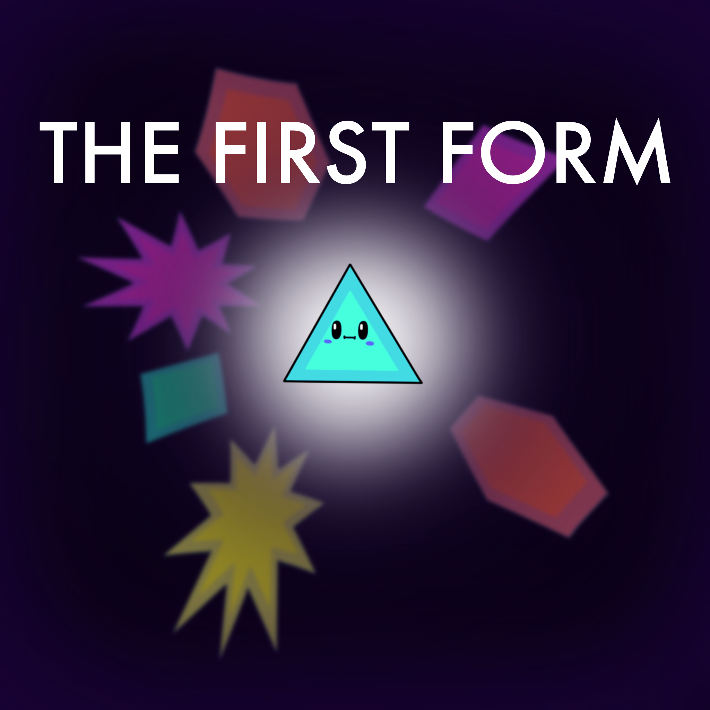

# Nombre del grupo
Grupo d3 - Axkuve

# Componentes
## Apellido, Nombre (una entrada por miembro)
* Valero, Diego
* dvb7@alu.ua.es
* diegovb7
---
* García, Raquel
* rgg96@alu.ua.es
* raquelgg00
---
* Mora, Gaspar
* gmr31@alu.ua.es
* GaspiMr6
---
* Gil, Laura
* lgl52@alu.ua.es
* Lauriscus20
---
* Davó, Vanessa
* vdp8@alu.ua.es
* VanessaDP
---
* Novelda, Guillermo
* gnm5@alu.ua.es
* gnm5

# Nombre del juego
## "The First Form"
The First Form es un juego de plataformas que se desarrolla en un mundo con tres fases. Estas fases vienen definidas por las etapas de desarrollo de Piaget (sensiomotriz, preoperacional y operaciones concretas y formales) y representarán la evolución y crecimiento del personaje. La evolución se mostrará con el aumento de las aristas de la figura y las habilidades disponibles. El jugador deberá ir obteniendo habilidades para poder completar los nieveles que irán aumentando en dificultad. En la primera fase, se desarrolla la visión, el salto y el rebote. En la segunda fase, se podrá atravesar objetos yencontraremos niveles con un poco más de lógica utilizando empujar y romper. Por último, en la tercera fase, la gravedad toma un papel importante y el desarrollo del personaje se completará con la habilidad de encogerse.

# Carátula del juego

# Comentarios sobre la práctica que se consideren oportunos
El juego se encuentra terminado. Además, todos los sprites son nuestros y la mayoríaa de sonidos también.